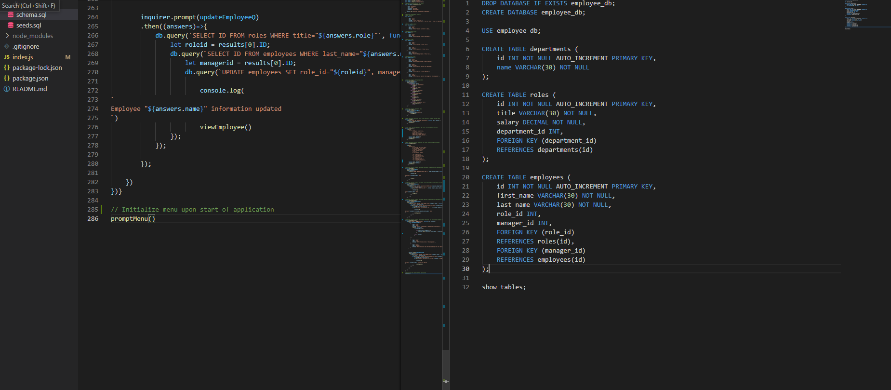

# Employee Tracker
The aim of this project is to create an employee tracker that allows users to view and manipulate employee information stored in SQL database by choosing options from a given menu. The application resembles content management system(CMS) interfaces. This command line application is built from Node.js, Inquirer and MySQL.
​
<br/>

### Prerequisites
​
The application uses node.js. For download and installation procedure, see [Link](https://nodejs.org/en/download/).


<br/>

### Installing

To use the application, the user should open terminal/git bash, locate the EmployeeTracker folder, perform ```npm install``` to install the required packages (inquirer, mysql2, console.table). After installation completes, user may initiate the sql database with command ```mysql -u root -p``` and entering the credentials recorded in the index.js file, then perform ```source schema.sql```. Then the user may choose to populate the database with sample data from seeds.sql file, with command ```source seeds.sql```. Then the user can initiate the application by navigating back to the EmployeeTracker directory and command ```node index.js```.

<br/>

## Built With

* Javascript
* mySQL2
* Node JS
* Inquirer JS
* Console.table

​<br/>

## Application Code

View javascript comments.

## Demonstration

See link to youtube:
[](https://youtu.be/URIr1xNJCso)


## Authors

* **Tony Zhang** 
- [Link to Portfolio Site](https://tonyzyt9947.github.io/PersonalPortfolio/)
- [Link to Github](https://github.com/Tonyzyt9947)
- [Link to LinkedIn](https://www.linkedin.com/in/tony-zhang-61670421b/)
​
<br/><br/>

## License
​
This project is licensed under the MIT License 
​
<br/><br/>
## Acknowledgments 
